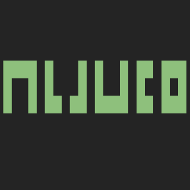
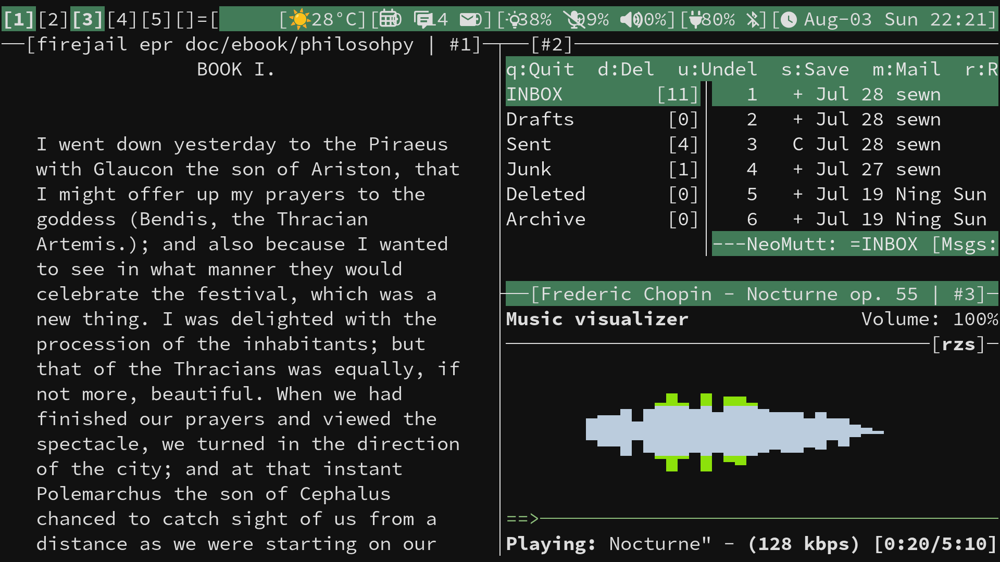

#  My build of [abduco](https://github.com/martanne/abduco) a tool for session {at,de}tach support


[abduco](https://www.brain-dump.org/projects/abduco) provides
session management i.e. it allows programs to be run independently
from their controlling terminal. That is programs can be detached -
run in the background - and then later reattached. Together with
[dvtm](https://www.brain-dump.org/projects/dvtm) it provides a
simpler and cleaner alternative to tmux or screen.

## Usage
Manage abduco sessions with my build of dvtm(
[codeberg](https://codeberg.org/unixchad/dvtm) or
[github](https://github.com/gnuunixchad/dvtm))
```sh
# Create a new session
abduco -c my-session

# Detached a session: `CTRL-\`

# List existing sessions by name
abduco

# Attach an existing session by name
abduco -a my-session

# Kill a session
pgrep -a abduco
pkill PID
```

## Environments
```sh
export ABDUCO_SOCKET_DIR=/$XDG_RUNTIME_DIR
```

## License

abduco is licensed under the [ISC license](https://raw.githubusercontent.com/martanne/abduco/master/LICENSE)
